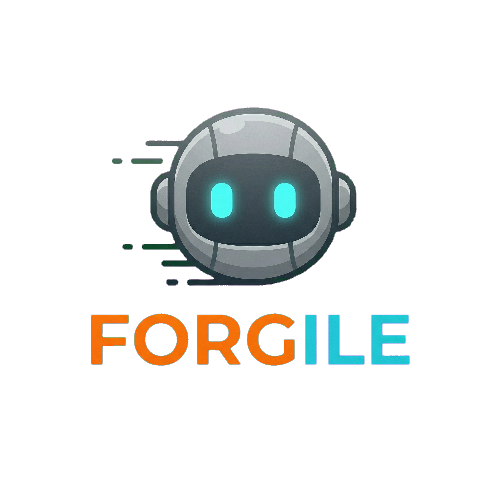

  
    
  
Onde pessoas são forjadas em desenvolvedores — Código · Caráter · Carreira

   
  
  
  
  
  

## O que é o Forgile

EdTech de formação do desenvolvedor completo. Três pilares integrados:

- **Código** — domínio técnico que o mercado exige
- **Caráter** — inteligência emocional, resiliência e desenvolvimento pessoal
- **Carreira** — preparação profissional e evolução contínua

O primeiro passo é o **Código**: aprender programação praticando de verdade. A pessoa estuda, escreve código, executa, recebe feedback imediato, entende o erro e evolui — com o Forgy, nosso robô ferreiro, acompanhando cada etapa.

---

## Repositórios

| Repositório | Descrição | Status |
|---|---|---|
| [forgile-api](https://github.com/forgile-app/forgile-api) | Backend e documentação da plataforma — Java 25 + Spring Boot 4.1 | 🔄 Em desenvolvimento |
| [forgile-web](https://github.com/forgile-app/forgile-web) | Aplicação web — React 19 + TypeScript + Vite | 🔄 Em desenvolvimento |
| [forgile-landing](https://github.com/forgile-app/forgile-landing) | Landing page — forgile.com | ⏳ Em breve |
| [forgile-mobile](https://github.com/forgile-app/forgile-mobile) | App mobile | 🔮 Depois do MVP |

---

## Stack

| Camada | Tecnologia |
|---|---|
| Backend | Java 25 · Spring Boot 4.1 · monólito modular |
| Banco | PostgreSQL 18 · Liquibase |
| Frontend | React 19 · TypeScript · Vite · TanStack Query |
| Execução de código | Judge0, isolado do backend |
| IA | Spring AI (dicas e explicações de erros) |
| Infra | Docker Compose · GitHub Actions |

---

  Brasília, DF · Brasil

